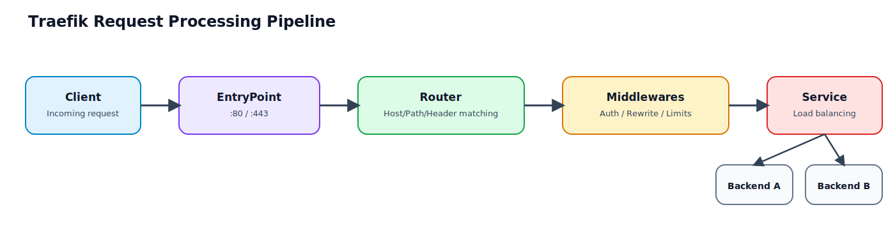

# 01. Traefik 핵심 구조: 프록시와 게이트웨이 관점

이 장은 Traefik의 구성요소를 "기능 목록"이 아니라 "요청이 실제로 흘러가는 순서"로 이해하는 데 목적이 있습니다.  
핵심은 아래 한 문장입니다.

`EntryPoint`로 들어온 요청이 `Router`에서 매칭되고, `Middleware`를 거쳐 `Service`로 전달된다.

## 이 장을 끝내면 할 수 있는 일

1. Traefik의 4대 구성요소(EntryPoints, Routers, Middlewares, Services)를 요청 흐름으로 설명할 수 있다.
2. Host/Path 규칙으로 라우터를 설계하고, 충돌 시 우선순위를 통제할 수 있다.
3. 프록시 관점과 게이트웨이 관점에서 같은 설정을 다르게 해석하고 운영 기준을 세울 수 있다.

## 요청 처리 파이프라인



프록시든 게이트웨이든 이 순서는 동일합니다.  
다만 어떤 규칙과 미들웨어를 어디까지 적용할지의 운영 정책이 달라집니다.

## 4대 구성요소를 운영 관점으로 이해하기

## 1) EntryPoints: 트래픽 유입 경계

- 의미: Traefik이 수신 대기하는 네트워크 포인트(예: `:80`, `:443`)
- 역할: "어느 포트/프로토콜로 들어온 요청인가"를 1차로 구분
- 실무 포인트:
1. `web(:80)`와 `websecure(:443)`를 분리해 HTTPS 전환 정책을 명확히 한다.
2. 내부 관리 트래픽과 외부 사용자 트래픽의 진입점을 분리할 수 있다.

예시(정적 설정):

```yaml
entryPoints:
  web:
    address: ":80"
  websecure:
    address: ":443"
```

## 2) Routers: "어떤 요청을 어디로 보낼지"를 결정

- 의미: 규칙 매칭 엔진
- 주요 규칙: `Host`, `Path`, `PathPrefix`, `Method`, `Headers` 등
- 실무 포인트:
1. 프록시 패턴은 주로 `Host` 중심으로 설계한다.
2. 게이트웨이 패턴은 주로 `PathPrefix` 중심으로 설계한다.
3. 충돌 가능성이 있으면 `priority`를 명시해 의도를 고정한다.

예시:

```yaml
http:
  routers:
    app-router:
      rule: "Host(`app.localhost`)"
      entryPoints: ["web"]
      service: app-svc

    api-router:
      rule: "Host(`example.localhost`) && PathPrefix(`/api`)"
      entryPoints: ["web"]
      service: api-svc
```

## 3) Middlewares: 공통 정책 계층

- 의미: 라우터와 서비스 사이에서 요청/응답을 가공하는 체인
- 대표 기능:
1. 경로 조정: `StripPrefix`, `ReplacePath`
2. 보안: 헤더, 인증
3. 보호: rate limit, allow list

프록시/게이트웨이 차이:
- 프록시: 미들웨어 최소 적용(필요 정책만)
- 게이트웨이: 공통 정책 집중 적용(인증/로깅/속도 제한)

## 4) Services: 최종 upstream 정의

- 의미: 실제 목적지 백엔드(1개 이상)
- 역할: 로드밸런싱, 헬스체크(구성 방식에 따라)
- 실무 포인트:
1. "라우터는 선택", "서비스는 전달 대상"으로 분리해서 사고한다.
2. 프록시 체이닝에서는 최종 앱 대신 "다른 프록시 주소"를 서비스로 둔다.

## 프록시 vs 게이트웨이: 같은 엔진, 다른 설계 기준

| 구분 | 프록시 서버 관점 | API 게이트웨이 관점 |
|---|---|---|
| 기본 매칭 | `Host` 중심 | `PathPrefix` 중심 |
| 정책 위치 | 서비스별 분산 가능 | 게이트웨이 중앙 집중 |
| 미들웨어 강도 | 최소 정책 | 공통 정책 다수 적용 |
| 목표 | 도메인/서비스 분기 | 단일 진입점 + 정책 통합 |

핵심은 구성요소가 아니라 우선순위입니다.
1. 프록시는 "분기 정확성"이 1순위
2. 게이트웨이는 "정책 일관성"이 1순위

## Router 규칙과 우선순위(반드시 알아야 할 핵심)

라우터는 동시에 여러 개가 매칭될 수 있습니다.  
이때 의도하지 않은 라우터가 선택되면 라우팅 오류가 발생합니다.

대표 충돌 예시:
1. `PathPrefix(`/api`)`
2. `PathPrefix(`/api/admin`)`

`/api/admin/users` 요청은 두 규칙 모두 매칭됩니다.  
이럴 때는 더 구체적인 라우터에 `priority`를 높게 주어 의도를 명시합니다.

```yaml
http:
  routers:
    api-router:
      rule: "Host(`example.localhost`) && PathPrefix(`/api`)"
      service: api-svc
      priority: 100

    api-admin-router:
      rule: "Host(`example.localhost`) && PathPrefix(`/api/admin`)"
      service: admin-svc
      priority: 200
```

운영 기준:
1. 겹칠 가능성이 있는 규칙은 처음부터 `priority`를 명시한다.
2. "더 구체적인 규칙 = 더 높은 priority" 원칙을 팀 규칙으로 고정한다.

## 최소 동작 예제(개념 검증용)

아래 예제는 "서브도메인 분기 + path 분기"를 한 화면에서 보여주는 최소 구성입니다.

```yaml
http:
  routers:
    app-by-host:
      rule: "Host(`app.localhost`)"
      entryPoints: ["web"]
      service: app-svc

    api-by-host:
      rule: "Host(`api.localhost`)"
      entryPoints: ["web"]
      service: api-svc

    auth-by-path:
      rule: "Host(`gateway.localhost`) && PathPrefix(`/auth`)"
      entryPoints: ["web"]
      middlewares: ["strip-auth"]
      service: auth-svc
      priority: 150

  middlewares:
    strip-auth:
      stripPrefix:
        prefixes:
          - "/auth"

  services:
    app-svc:
      loadBalancer:
        servers:
          - url: "http://app:8080"
    api-svc:
      loadBalancer:
        servers:
          - url: "http://api:8080"
    auth-svc:
      loadBalancer:
        servers:
          - url: "http://auth:8080"
```

검증 예시:

```bash
curl -H 'Host: app.localhost' http://localhost
curl -H 'Host: api.localhost' http://localhost
curl -H 'Host: gateway.localhost' http://localhost/auth/health
```

## 자주 하는 실수와 바로잡는 방법

1. 라우터 충돌을 우연에 맡김
- 증상: 특정 경로가 가끔 다른 서비스로 간다.
- 조치: 겹치는 규칙에 `priority`를 명시.

2. Path 게이트웨이에서 prefix 제거를 누락
- 증상: 백엔드가 `/auth/login` 대신 `/login`을 기대해 404 발생.
- 조치: `StripPrefix` 또는 `ReplacePath` 적용.

3. 서비스 책임과 라우터 책임 혼동
- 증상: 분기 로직을 서비스 쪽에서 처리하려다 설정 복잡도 증가.
- 조치: 선택은 라우터, 목적지는 서비스로 역할 분리.

4. 운영 정책을 라우터마다 중복 선언
- 증상: 인증/보안 정책 불일치.
- 조치: 공통 미들웨어 체인을 만들어 일괄 적용.

## 요약

1. Traefik의 핵심은 `EntryPoint -> Router -> Middleware -> Service` 요청 파이프라인이다.
2. 프록시와 게이트웨이는 구성요소가 아니라 운영 우선순위가 다르다.
3. 라우팅 품질의 핵심은 Router 규칙 충돌 관리이며, `priority` 명시가 가장 안전하다.
4. 다음 장의 실습 환경 준비 전에, 현재 장의 규칙/우선순위 감각을 먼저 고정해야 이후 구성이 흔들리지 않는다.

## 다음 장 준비

다음 장에서는 로컬 도메인 해석(`*.localhost` 또는 `hosts`), Docker 네트워크, 포트 설계를 통해  
실제로 Traefik 라우팅을 검증할 수 있는 실습 베이스를 구성합니다.

## 다음 챕터

- [02. 실습 환경 준비: 도메인/네트워크/Docker](./02-lab-setup-and-network-basics.md)
