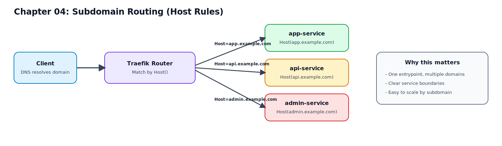

# 04. 서브도메인 라우팅 1: Host 규칙으로 분기

이 장에서는 Traefik을 "서브도메인 분기 프록시"로 사용하는 가장 기본적인 패턴을 다룹니다.  
핵심은 `Host(...)` 규칙으로 요청을 정확하게 분기하는 것입니다.

## 이 장을 끝내면 할 수 있는 일

1. `app`, `api`, `admin` 서브도메인을 서로 다른 백엔드로 라우팅한다.
2. Host 규칙과 EntryPoint 조합으로 분기 정책을 설명할 수 있다.
3. `curl + 대시보드 + 로그`로 라우팅 결과를 검증할 수 있다.

## 반드시 알아야 할 핵심

- `Host` 매처와 `entrypoints` 조합이 서브도메인 프록시의 기본 단위다.

## 요청 흐름 다이어그램



## Host 규칙의 기본 문법

Traefik 라우터는 요청의 Host 헤더를 기준으로 매칭할 수 있습니다.

예시:

```yaml
traefik.http.routers.app.rule=Host(`app.localhost`)
traefik.http.routers.api.rule=Host(`api.localhost`)
traefik.http.routers.admin.rule=Host(`admin.localhost`)
```

중요 포인트:
1. Host 규칙은 DNS/hosts 해석과 함께 동작한다.
2. 테스트 시 브라우저 대신 `curl -H 'Host: ...'`로 먼저 사실관계를 확인한다.
3. 라우터마다 `entrypoints`를 명시해 유입 경계를 고정한다.

## 설계 패턴: 서브도메인 1개 = 서비스 1개

아래 패턴이 가장 단순하고 운영 친화적입니다.

1. `app.<domain>` -> 앱 프론트엔드
2. `api.<domain>` -> API 서버
3. `admin.<domain>` -> 운영/관리 도구

장점:
1. 서비스 경계가 명확하다.
2. 장애 영향 범위를 서브도메인 단위로 분리할 수 있다.
3. TLS 인증서 정책(SAN 또는 와일드카드)도 일관되게 가져가기 쉽다.

## 실습 구성 예제 (Docker labels)

아래 예시는 현재 실습 compose에 그대로 확장 가능한 형태입니다.  
핵심은 "서비스별 라우터 이름과 Host 규칙을 분리"하는 것입니다.

```yaml
services:
  app:
    image: traefik/whoami:v1.10
    container_name: lab-app
    labels:
      - traefik.enable=true
      - traefik.http.routers.app.rule=Host(`app.localhost`)
      - traefik.http.routers.app.entrypoints=web
      - traefik.http.routers.app.middlewares=default-chain@file
      - traefik.http.services.app.loadbalancer.server.port=80

  api:
    image: traefik/whoami:v1.10
    container_name: lab-api
    labels:
      - traefik.enable=true
      - traefik.http.routers.api.rule=Host(`api.localhost`)
      - traefik.http.routers.api.entrypoints=web
      - traefik.http.routers.api.middlewares=default-chain@file
      - traefik.http.services.api.loadbalancer.server.port=80

  admin:
    image: traefik/whoami:v1.10
    container_name: lab-admin
    labels:
      - traefik.enable=true
      - traefik.http.routers.admin.rule=Host(`admin.localhost`)
      - traefik.http.routers.admin.entrypoints=web
      - traefik.http.routers.admin.middlewares=default-chain@file
      - traefik.http.services.admin.loadbalancer.server.port=80
```

참고:
1. `default-chain@file`은 03장에서 구성한 File provider 미들웨어 체인을 재사용합니다.
2. 서비스 포트가 80이 아니면 `loadbalancer.server.port`를 실제 값으로 맞춰야 합니다.

## 로컬 도메인 준비

우선 `*.localhost`로 진행하고, 환경에 따라 필요하면 `/etc/hosts`를 사용합니다.

`/etc/hosts` 예시:

```text
127.0.0.1 app.localhost api.localhost admin.localhost
```

## 실행 및 검증 절차

## 1) 컨테이너 실행

```bash
cd /path/to/traefik-book
docker compose -f examples/docker-compose.yml up -d
```

## 2) Host 기반 분기 검증

```bash
curl -H 'Host: app.localhost' http://localhost
curl -H 'Host: api.localhost' http://localhost
curl -H 'Host: admin.localhost' http://localhost
```

정상 기준:
1. 세 요청이 모두 200 응답
2. 응답 본문에서 서로 다른 서비스 컨테이너 정보 확인

## 3) 대시보드 검증

- `http://localhost:8080/dashboard/`

확인 항목:
1. `app`, `api`, `admin` 라우터가 각각 존재하는지
2. 각 라우터가 예상 서비스에 연결되는지
3. 미들웨어(`default-chain@file`)가 적용됐는지

## 운영에서 자주 겪는 문제

1. 요청이 항상 404로 떨어짐
- 원인: Host 헤더가 매칭되지 않음
- 조치: `curl -H 'Host: ...'`로 재검증, 도메인 해석 확인

2. 특정 서브도메인만 동작 안 함
- 원인: 해당 서비스의 `traefik.enable` 누락 또는 라벨 오탈자
- 조치: 컨테이너 라벨 재확인 후 재기동

3. 라우터는 보이는데 백엔드 연결 실패
- 원인: `loadbalancer.server.port` 불일치
- 조치: 서비스 내부 listen 포트와 라벨 값 일치 여부 확인

4. HTTP는 되는데 HTTPS에서만 실패
- 원인: `entrypoints`/TLS 설정 불일치
- 조치: 현재 장에서는 `web` 기준으로 고정하고, HTTPS는 10장에서 확장

## 운영 적용 시 가이드

1. DNS 레코드를 서브도메인별로 명확히 분리한다.
2. 인증서 전략을 미리 선택한다.
- SAN 인증서(개별 도메인 명시)
- 와일드카드 인증서(`*.example.com`)
3. 대시보드 공개 정책을 제한한다.
- 현재 실습의 `api.insecure=true`는 운영에서 금지

## 요약

1. 서브도메인 분기의 본질은 `Host` 규칙을 서비스 경계와 일치시키는 것이다.
2. 라우터 단위는 "서브도메인 1개 = 라우터 1개"로 단순하게 유지하는 것이 안전하다.
3. 검증은 `curl(Host 헤더) -> Dashboard -> logs` 순서로 진행하면 빠르게 원인을 좁힐 수 있다.
4. 다음 장에서는 이 구조를 다중 인스턴스/로드밸런싱 관점으로 확장한다.

## 다음 챕터

- [05. 서브도메인 라우팅 2: 다중 서버 프록시 패턴](./05-multi-service-proxy-patterns.md)
