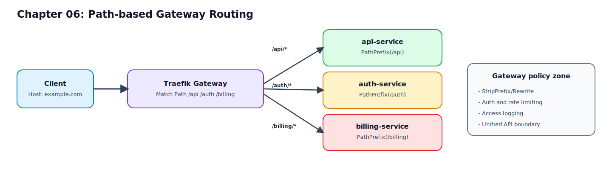

# 06. Path 게이트웨이 라우팅

이 장에서는 Host 분기 중심(04~05장)에서 한 단계 이동해,  
단일 도메인 아래 여러 API 경로를 서비스별로 분기하는 게이트웨이 패턴을 구성합니다.

## 이 장을 끝내면 할 수 있는 일

1. `gateway.localhost` 한 도메인에서 `/api`, `/api/admin`, `/auth`, `/billing`을 각 서비스로 분기한다.
2. `Path`, `PathPrefix`, `priority`를 구분해 충돌 없는 규칙을 설계한다.
3. 경로 라우팅 실패를 `curl + Dashboard + logs`로 진단할 수 있다.

## 반드시 알아야 할 핵심

- `PathPrefix`, `Path`, `priority`는 함께 설계해야 안전하다.

## 요청 흐름 다이어그램



## 왜 Path 게이트웨이가 필요한가

서브도메인 분기는 서비스 경계가 명확하지만,  
외부 클라이언트에 단일 진입점 URL을 제공해야 할 때는 게이트웨이 패턴이 더 유리합니다.

예:
1. `https://api.example.com/api/*`
2. `https://api.example.com/auth/*`
3. `https://api.example.com/billing/*`

장점:
1. 외부 API 경계를 단일 도메인으로 통합
2. 인증/로깅/정책 적용 지점 일원화
3. 버전/조직 정책을 URL 경로로 관리 가능

## 매처 선택 기준: Path vs PathPrefix

## `Path`

- 정확히 같은 경로만 매칭
- 사용 예: `/healthz`, `/ready`, `/login/callback`

예:

```text
Path(`/healthz`)  # /healthz만 매칭, /healthz/anything은 매칭 안 됨
```

## `PathPrefix`

- 특정 prefix로 시작하는 모든 경로 매칭
- 사용 예: `/api`, `/auth`, `/billing`

예:

```text
PathPrefix(`/api`)  # /api, /api/users, /api/v1/orders 모두 매칭
```

실무 기준:
1. 서비스 경계 라우팅은 `PathPrefix` 우선
2. 단일 엔드포인트 분기는 `Path` 사용
3. 혼합 시 충돌 가능성을 `priority`로 명시

## 라우터 충돌과 priority

아래 두 규칙은 충돌할 수 있습니다.
1. `PathPrefix(`/api`)`
2. `PathPrefix(`/api/admin`)`

`/api/admin/users`는 두 라우터에 모두 매칭됩니다.  
이때 더 구체적인 라우터를 우선시키기 위해 `priority`를 사용합니다.

```yaml
- traefik.http.routers.api.rule=Host(`gateway.localhost`) && PathPrefix(`/api`)
- traefik.http.routers.api.priority=100

- traefik.http.routers.api-admin.rule=Host(`gateway.localhost`) && PathPrefix(`/api/admin`)
- traefik.http.routers.api-admin.priority=200
```

팀 규칙으로 고정할 것:
1. 더 구체적인 path가 더 높은 priority
2. 겹침 가능성이 있으면 priority를 항상 명시

## 실습 구성 예제 (Docker labels)

아래 예시는 단일 도메인 `gateway.localhost`에서 Path 기준으로 분기하는 기본형입니다.

```yaml
services:
  api:
    image: traefik/whoami:v1.10
    labels:
      - traefik.enable=true
      - traefik.http.routers.gw-api.rule=Host(`gateway.localhost`) && PathPrefix(`/api`)
      - traefik.http.routers.gw-api.entrypoints=web
      - traefik.http.routers.gw-api.priority=120
      - traefik.http.routers.gw-api.middlewares=default-chain@file
      - traefik.http.services.gw-api.loadbalancer.server.port=80

  auth:
    image: traefik/whoami:v1.10
    labels:
      - traefik.enable=true
      - traefik.http.routers.gw-auth.rule=Host(`gateway.localhost`) && PathPrefix(`/auth`)
      - traefik.http.routers.gw-auth.entrypoints=web
      - traefik.http.routers.gw-auth.priority=120
      - traefik.http.routers.gw-auth.middlewares=default-chain@file
      - traefik.http.services.gw-auth.loadbalancer.server.port=80

  billing:
    image: traefik/whoami:v1.10
    labels:
      - traefik.enable=true
      - traefik.http.routers.gw-billing.rule=Host(`gateway.localhost`) && PathPrefix(`/billing`)
      - traefik.http.routers.gw-billing.entrypoints=web
      - traefik.http.routers.gw-billing.priority=120
      - traefik.http.routers.gw-billing.middlewares=default-chain@file
      - traefik.http.services.gw-billing.loadbalancer.server.port=80

  admin:
    image: traefik/whoami:v1.10
    labels:
      - traefik.enable=true
      - traefik.http.routers.gw-api-admin.rule=Host(`gateway.localhost`) && PathPrefix(`/api/admin`)
      - traefik.http.routers.gw-api-admin.entrypoints=web
      - traefik.http.routers.gw-api-admin.priority=220
      - traefik.http.routers.gw-api-admin.middlewares=default-chain@file
      - traefik.http.services.gw-api-admin.loadbalancer.server.port=80
```

참고:
1. 충돌 테스트를 위해 `gw-api`와 `gw-api-admin`을 함께 포함했습니다.
2. 여기서는 경로 변환(`StripPrefix`/`ReplacePath`)을 아직 다루지 않습니다.
3. 경로 변환과 정책 적용은 다음 장(07)에서 집중적으로 다룹니다.

## 실행 및 검증 절차

## 1) 서비스 기동

아래 절차는 위 라벨 예시를 `examples/docker-compose.yml`에 반영한 상태를 기준으로 합니다.

```bash
cd /path/to/traefik-book
docker compose -f examples/docker-compose.yml up -d
```

## 2) Path 분기 검증

```bash
curl -H 'Host: gateway.localhost' http://localhost/api/ping
curl -H 'Host: gateway.localhost' http://localhost/api/admin/ping
curl -H 'Host: gateway.localhost' http://localhost/auth/ping
curl -H 'Host: gateway.localhost' http://localhost/billing/ping
```

검증 포인트:
1. 각 경로 요청이 서로 다른 서비스 응답으로 분기되는지
2. 404 없이 라우터가 정확히 매칭되는지

## 3) 대시보드 확인

- `http://localhost:8080/dashboard/`

확인 항목:
1. `gw-api`, `gw-api-admin`, `gw-auth`, `gw-billing` 라우터 존재
2. 각 라우터의 rule/priority가 의도대로 설정
3. 서비스 연결 대상이 올바른지

## 4) 충돌 시나리오 테스트

예: `/api` vs `/api/admin` 충돌  
아래 테스트는 위 예제처럼 `admin` 서비스를 추가한 상태를 전제로 합니다.

```bash
# 1) 정상 상태 확인 (admin 라우터가 선택되어야 함)
curl -s -H 'Host: gateway.localhost' http://localhost/api/admin/users | grep -i hostname

# 2) examples/docker-compose.yml에서
#    traefik.http.routers.gw-api-admin.priority=220 값을 80으로 수정한 뒤 admin 서비스 재기동
docker compose -f examples/docker-compose.yml up -d --force-recreate admin
curl -s -H 'Host: gateway.localhost' http://localhost/api/admin/users | grep -i hostname

# 3) 같은 값을 220으로 원복한 뒤 다시 재기동/재검증
docker compose -f examples/docker-compose.yml up -d --force-recreate admin
curl -s -H 'Host: gateway.localhost' http://localhost/api/admin/users | grep -i hostname
```

테스트 목적:
1. 구체 경로(`/api/admin`)가 더 높은 priority일 때 admin 라우터로 고정되는지 확인
2. priority를 낮추면 `/api` 라우터로 역매칭되는 문제를 재현하고 복구 절차를 익힌다.

## 자주 발생하는 실수

1. Host 조건 없이 Path만 사용
- 증상: 의도하지 않은 도메인 요청까지 매칭
- 조치: 게이트웨이 라우터에 `Host(...)`를 항상 포함

2. `/api`와 `/api/` 구분을 놓침
- 증상: 일부 요청만 404
- 조치: `PathPrefix` 기준으로 설계하고 테스트 경로를 다양화

3. 충돌 구간에 priority 누락
- 증상: 특정 path가 가끔 다른 서비스로 전달
- 조치: 겹치는 모든 라우터에 priority 명시

4. 백엔드 기대 경로와 게이트웨이 경로 불일치
- 증상: 라우터 매칭은 되는데 백엔드 404
- 조치: 07장에서 `StripPrefix`/`ReplacePath` 적용

## 운영 적용 가이드

1. 공개 API prefix를 팀 표준으로 고정한다.
- `/api`, `/auth`, `/billing`, `/internal` 등
2. 라우터 네이밍 규칙을 도메인+경로 기준으로 통일한다.
- `gw-api`, `gw-auth` 같은 명명
3. 우선순위 정책을 문서화한다.
- 구체 path가 항상 높은 priority
4. 신규 경로 추가 시 충돌 테스트를 CI에 포함한다.

## 요약

1. Path 게이트웨이는 단일 도메인에서 서비스 경계를 관리하는 패턴이다.
2. 핵심은 `Host + PathPrefix + priority`를 함께 설계하는 것이다.
3. 충돌 방지와 검증 루틴을 갖추면 경로 기반 라우팅은 안정적으로 운영 가능하다.
4. 다음 장에서는 경로를 백엔드가 원하는 형태로 변환하고 정책을 적용하는 미들웨어를 다룬다.

## 다음 챕터

- [07. 게이트웨이 미들웨어: StripPrefix, Rewrite, 정책 적용](./07-gateway-middlewares-for-path-services.md)
