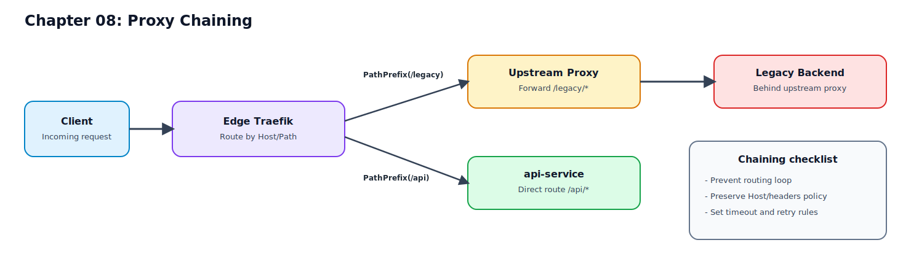

# 08. 특정 요청을 다른 프록시로 전달하기 (Proxy Chaining)

07장에서 게이트웨이 미들웨어를 구성했다면, 이제는 일부 요청만 "다른 프록시"로 넘겨야 할 때가 옵니다.  
이 장에서는 Traefik을 엣지 프록시로 두고, 특정 경로/도메인을 상위 프록시(upstream proxy)로 전달하는 체인을 구성합니다.

## 이 장을 끝내면 할 수 있는 일

1. 특정 요청(`PathPrefix` 또는 `Host`)만 upstream proxy로 전달한다.
2. upstream proxy를 Traefik `service`로 선언해 체이닝 구조를 만든다.
3. 루프 방지, Host 헤더 처리, timeout/retry 설정을 운영 기준으로 적용한다.

## 반드시 알아야 할 핵심

- Proxy Chaining의 핵심은 "라우터 분기"가 아니라 "upstream service 선언과 루프 방지"다.

## 요청 흐름 다이어그램



## Proxy Chaining이 필요한 상황

대표 시나리오:
1. 레거시 시스템이 별도 프록시 뒤에만 노출되는 구조
2. 조직/망 경계 때문에 직접 백엔드 접근이 어려운 구조
3. 일부 트래픽만 외부/타망 프록시로 보내야 하는 규제/운영 정책

예:
1. 일반 API: `gateway.localhost/api/*` -> 내부 서비스 직접 연결
2. 레거시 API: `gateway.localhost/legacy/*` -> upstream proxy -> legacy backend

## 구성 원칙

1. 외부 진입점(Edge)과 upstream proxy 역할을 분리한다.
2. proxy chain 대상 경로를 명시적으로 제한한다.
3. timeout/retry/healthcheck를 함께 설정한다.
4. 루프 가능성을 설계 단계에서 차단한다.

## 기본 구성 예시 (File Provider)

아래 예시는 `/legacy/*` 요청만 upstream proxy로 전달하는 최소 구성입니다.

```yaml
http:
  routers:
    legacy-chain:
      rule: "Host(`gateway.localhost`) && PathPrefix(`/legacy`)"
      entryPoints:
        - web
      service: legacy-upstream
      middlewares:
        - legacy-strip
        - legacy-retry
        - default-chain
      priority: 300

  middlewares:
    legacy-strip:
      stripPrefix:
        prefixes:
          - "/legacy"

    legacy-retry:
      retry:
        attempts: 2
        initialInterval: 100ms

  services:
    legacy-upstream:
      loadBalancer:
        servers:
          - url: "http://upstream-proxy:8080"
        passHostHeader: false
```

설명:
1. `legacy-chain` 라우터가 chain 대상 요청만 잡는다.
2. `legacy-strip`으로 `/legacy` prefix를 제거해 upstream 기대 경로로 맞춘다.
3. `legacy-upstream` 서비스가 "최종 앱"이 아니라 "다른 프록시 URL"을 가리킨다.

## upstream proxy를 service로 선언할 때 체크할 것

1. `servers.url`은 반드시 edge Traefik 자신이 아닌 별도 endpoint여야 한다.
2. `passHostHeader` 정책을 upstream 요구사항에 맞춘다.
3. 경로 전달 방식(`strip`/`replace`)을 upstream 라우팅 기대와 일치시킨다.

`passHostHeader` 기준:
1. upstream이 원본 Host 기반 라우팅을 기대 -> `true`
2. upstream이 고정 Host를 기대 -> `false` + 필요 시 Host 재작성

Host 재작성 예시:

```yaml
http:
  middlewares:
    legacy-host:
      headers:
        customRequestHeaders:
          Host: "legacy.internal"
```

## timeout / transport / healthcheck (운영 필수)

체이닝은 네트워크 hop이 늘어나므로 timeout 정책이 중요합니다.

```yaml
http:
  serversTransports:
    upstream-tight:
      forwardingTimeouts:
        dialTimeout: 3s
        responseHeaderTimeout: 5s
        idleConnTimeout: 30s

  services:
    legacy-upstream:
      loadBalancer:
        servers:
          - url: "http://upstream-proxy:8080"
        serversTransport: upstream-tight
        healthCheck:
          path: "/healthz"
          interval: 10s
          timeout: 2s
```

운영 기준:
1. timeout은 서비스 SLA 기준으로 명시
2. healthcheck는 가볍고 안정적인 endpoint 사용
3. retry는 무조건 크게 잡지 말고 짧게 제한

## 루프 방지 전략

가장 위험한 실패는 프록시 루프입니다.

루프가 생기는 대표 원인:
1. upstream URL이 다시 edge Traefik으로 향함
2. upstream proxy가 동일 규칙으로 edge로 되돌림
3. Host/path 재작성 실수로 자기 자신 라우터 재매칭

예방 규칙:
1. upstream은 내부 전용 DNS/네트워크 주소 사용
2. edge와 upstream 라우팅 규칙을 분리 문서화
3. chain 전용 경로(`/legacy/*`)를 좁게 유지
4. 배포 전 루프 테스트 케이스를 필수로 수행

## 실습 절차

## 1) chain 라우터 및 upstream 서비스 추가

`examples/traefik-lab/dynamic/dynamic.yml`에 `legacy-chain`, `legacy-upstream` 구성을 추가합니다.

## 2) 설정 반영 확인

```bash
docker compose -f examples/docker-compose.yml up -d
docker compose -f examples/docker-compose.yml logs -f traefik
```

## 3) 요청 검증

```bash
curl -i -H 'Host: gateway.localhost' http://localhost/legacy/ping
```

정상 기준:
1. 라우터 매칭 성공
2. upstream proxy를 통해 응답 반환
3. 5xx 급증 없이 응답 시간 안정

## 4) 비교 검증(체이닝 외 경로)

```bash
curl -i -H 'Host: gateway.localhost' http://localhost/api/ping
```

목적:
1. `/legacy`만 체이닝되고 나머지는 기존 라우팅 유지되는지 확인

## 트러블슈팅

1. 502 Bad Gateway
- 원인: upstream URL 오타, 네트워크 미연결, upstream down
- 조치: `servers.url` 확인, 컨테이너 네트워크/포트 확인

2. 응답 지연/타임아웃
- 원인: hop 증가, timeout 미설정
- 조치: `serversTransport.forwardingTimeouts` 명시

3. upstream에서 404
- 원인: 경로 변환 불일치(`/legacy` strip 누락)
- 조치: `StripPrefix`/`ReplacePath` 정책 재검토

4. 요청이 반복 순환(루프 의심)
- 증상: 응답 지연 급증, 로그 반복 패턴
- 조치: upstream 주소/규칙 분리, chain 대상 경로 축소

5. Host 기반 upstream 라우팅 실패
- 원인: `passHostHeader`/Host 재작성 정책 불일치
- 조치: upstream 요구 Host 기준으로 헤더 정책 맞춤

## 운영 체크리스트

1. chain 대상 경로/도메인이 명시적으로 제한되어 있는가
2. upstream 주소가 edge 자신을 가리키지 않는가
3. timeout/retry/healthcheck가 선언되어 있는가
4. Host 전달 정책(`passHostHeader`)이 문서화되어 있는가
5. 루프 테스트를 배포 전 자동/수동으로 수행했는가

## 요약

1. Proxy Chaining은 "요청 일부를 다른 프록시로 위임"하는 패턴이다.
2. 핵심 구현은 upstream proxy를 Traefik `service`로 선언하는 것이다.
3. 경로 변환, Host 헤더, timeout 정책을 함께 설계해야 장애를 줄일 수 있다.
4. 루프 방지가 가장 중요한 운영 안전장치다.

## 다음 챕터

- [09. 엣지 보안 필수: 인증, 헤더, 속도 제한](./09-security-basics-for-edge-routing.md)
